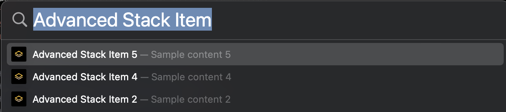

# Spotlight Python Service Starter

A starter script to register custom data to the MacOS Spotlight index using Python

You can use this script and the following instructions to add your custom data in MacOS Spotlight index.



## Install dependencies

```shell
python3 -m venv venv
source venv/bin/activate
pip3 install -r requirements.txt
```

## Build instructions

```shell
pyinstaller --add-data ./assets/:. -i ./assets/logo.png --windowed --clean --noconfirm ./SpotlightPythonService.py
```

The bundled application is now in the `./dist` folder

